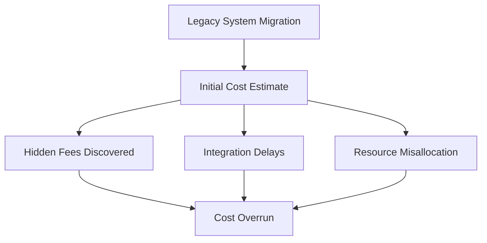
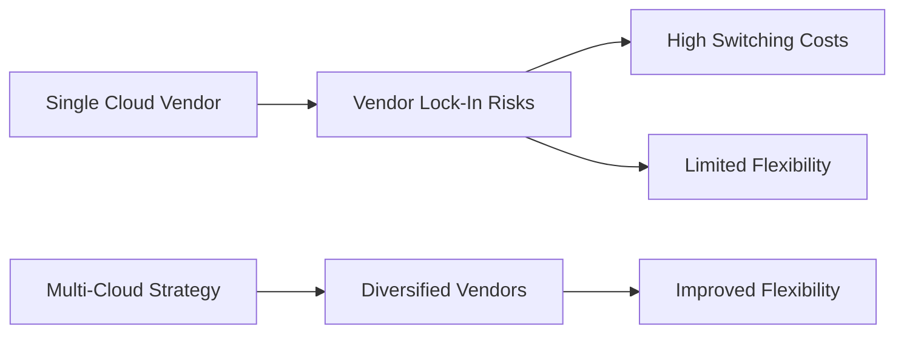
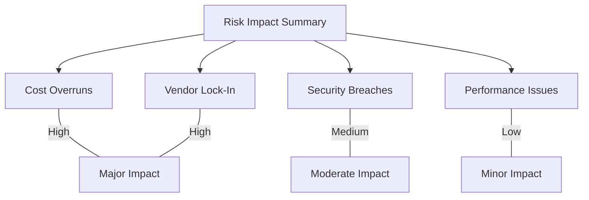

Below are all the required documents to help you successfully complete the scenario-based tasks. These include a set of templates (for risk assessment, scenario briefs, SWOT analysis, security improvement, performance optimization, compliance roadmap, and a unified action plan), an example report with fictitious data, and several diagrams in Markdown format. You can use these documents to structure your analysis and document your findings during group activities.

---

## 1. Risk Assessment Template

------------------------------------------------------------
              RISK ASSESSMENT TEMPLATE
------------------------------------------------------------
Scenario/Project Name: _________________________________

Risk Factor:
- Description: ___________________________________________
- Detailed Explanation: __________________________________

Impact:
- Potential Effects: _____________________________________
- Financial/Operational Impact: ___________________________

Likelihood:
- ( ) Low   ( ) Medium   ( ) High

Mitigation Strategy:
- Proposed Actions: ______________________________________
- Implementation Details: ________________________________

Responsible Party:
- Assigned Team/Person: ________________________________

Timeline for Mitigation:
- Target Date: ___________________________________________

Additional Comments/Notes:
- _______________________________________________________
------------------------------------------------------------

---

## 2. Scenario Brief Template

------------------------------------------------------------
               SCENARIO BRIEF TEMPLATE
------------------------------------------------------------
Scenario Title: ____________________________________________

Scenario Description:
- Provide background and context:
  ________________________________________________________
  ________________________________________________________

Key Data Points:
- Data 1: ________________________________________________
- Data 2: ________________________________________________
- Data 3: ________________________________________________

Impact:
- Describe the consequences on the organization:
  ________________________________________________________

Visual Aids/Diagrams:
- [Insert diagram or reference to included diagram if applicable]

Additional Notes:
- ________________________________________________________
------------------------------------------------------------

---

## 3. SWOT Analysis Template

# SWOT Analysis Template

| **Strengths**                                           | **Weaknesses**                                           |
| ------------------------------------------------------- | -------------------------------------------------------- |
| - List internal advantages (e.g., robust infrastructure, strong vendor support) | - List internal challenges (e.g., skill gaps, outdated systems) |

| **Opportunities**                                       | **Threats**                                              |
| ------------------------------------------------------- | -------------------------------------------------------- |
| - List external opportunities (e.g., emerging cloud technologies, new markets) | - List external risks (e.g., regulatory changes, competitive pressure) |

*Instructions: Fill in each quadrant with relevant points that apply to your scenario analysis.*

---

## 4. Security Improvement Template

------------------------------------------------------------
             SECURITY IMPROVEMENT TEMPLATE
------------------------------------------------------------
Scenario Title: ____________________________________________

Security Issue/Gap:
- Specific Issue: _________________________________________
- Detailed Description: ___________________________________

Root Cause Analysis:
- Causes: _______________________________________________
- Contributing Factors: ___________________________________

Impact Analysis:
- Consequences: __________________________________________
- Affected Areas (e.g., data integrity, service availability): ____

Proposed Improvement/Remediation:
- Specific Steps: _________________________________________
- Process/Configuration Changes: __________________________

Tools/Resources Needed:
- Required Tools (e.g., Azure Security Center, Azure Sentinel): ___

Implementation Timeline:
- Target Date(s): _________________________________________

Responsible Team/Person:
- Assigned To: ____________________________________________

Follow-Up Actions:
- Scheduled Audits/Tests: ________________________________

Additional Comments/Notes:
- _______________________________________________________
------------------------------------------------------------

---

## 5. Performance Optimization Template

------------------------------------------------------------
          PERFORMANCE OPTIMIZATION TEMPLATE
------------------------------------------------------------
Scenario Title: ____________________________________________

Performance Issue:
- Specific Problem: _______________________________________
- Detailed Description: ___________________________________

Root Cause Analysis:
- Identified Bottlenecks: _________________________________
- Contributing Factors: ___________________________________

Impact Analysis:
- Operational Impact: _____________________________________
- Customer/Service Impact: ________________________________

Proposed Optimization Strategies:
- Strategy 1: _____________________________________________
- Strategy 2: _____________________________________________
- Strategy 3: _____________________________________________

Tools/Resources Needed:
- Required Tools (e.g., Azure Monitor, Application Insights): ___

Performance Metrics:
- Key Metrics to Monitor: ________________________________
- Target Improvements: ____________________________________

Implementation Timeline:
- Expected Completion Date: ____________________________

Responsible Team/Person:
- Assigned To: ____________________________________________

Additional Comments/Notes:
- _______________________________________________________
------------------------------------------------------------

---

## 6. Compliance Roadmap Template

------------------------------------------------------------
           COMPLIANCE ROADMAP TEMPLATE
------------------------------------------------------------
Scenario Title: ____________________________________________

Compliance Gaps:
- Gap 1: _________________________________________________
- Gap 2: _________________________________________________
- Gap 3: _________________________________________________

Impact Analysis:
- Consequences of Non-Compliance: ________________________

Proposed Remediation Steps:
- Step 1: ________________________________________________
- Step 2: ________________________________________________
- Step 3: ________________________________________________

Timeline for Remediation:
- Milestones & Target Dates: _____________________________

Tools/Resources Needed:
- Required Resources (e.g., automated compliance tools, audit software): ____

Responsible Team/Person:
- Assigned To: ____________________________________________

Follow-Up Actions:
- Scheduled Reviews/Checks: _____________________________

Additional Comments/Notes:
- _______________________________________________________
------------------------------------------------------------

---

## 7. Unified Action Plan Template

------------------------------------------------------------
             UNIFIED ACTION PLAN TEMPLATE
------------------------------------------------------------
Scenario/Project Name: ____________________________________

Key Risk Areas Identified:
- Cost Overruns: __________________________________________
- Security Gaps: ___________________________________________
- Vendor Lock-In: _________________________________________
- Performance Issues: _____________________________________

Integrated Mitigation Strategies:
- Strategy 1 (Cost): _______________________________________
- Strategy 2 (Security): ___________________________________
- Strategy 3 (Vendor): _____________________________________
- Strategy 4 (Performance): ________________________________

Overall Action Plan:
- Combined Steps: _________________________________________
- Interdependencies: ________________________________________

Expected Outcomes:
- Benefits/Improvements: _________________________________

Timeline:
- Milestone 1: ____________________________________________
- Milestone 2: ____________________________________________
- Overall Target Date: ____________________________________

Responsible Parties:
- Assigned Teams/Persons: _______________________________

Monitoring & Review:
- Key Metrics: ____________________________________________
- Review Schedule: ________________________________________

Additional Comments/Notes:
- _______________________________________________________
------------------------------------------------------------

---

## 8. Example Report Document (Fictitious Data)

------------------------------------------------------------
                EXAMPLE REPORT: COST OVERRUNS IN AZURE MIGRATION
------------------------------------------------------------

Scenario Title: Cost Overruns in Azure Migration – Company Alpha

Background:
Company Alpha migrated its legacy systems to Azure expecting a 20% cost reduction. However, the project experienced a 30% budget overrun due to hidden expenses.

Key Findings:
- **Hidden Fees:** Data egress fees were 15% higher than anticipated.
- **Integration Delays:** Integration of legacy systems with Azure took 25% longer than planned, resulting in increased labor costs.
- **Resource Misallocation:** Over-provisioning of compute instances led to inefficient use of resources.

Impact:
- The budget overrun strained financial resources.
- Delayed project timelines affected product launch dates.
- Customer satisfaction was impacted due to prolonged migration timelines.

Mitigation Strategies Proposed:
1. **Enhanced Cost Forecasting:** Incorporate detailed cost models including potential hidden fees.
2. **Improved Integration Planning:** Allocate additional time and resources for legacy system integration.
3. **Resource Optimization:** Implement auto-scaling and regular cost audits using Azure Cost Management.

Conclusion:
The report recommends a comprehensive review of cost models and integration processes before future migrations. Implementing robust monitoring and optimization tools is crucial for mitigating similar risks.

------------------------------------------------------------

---

## 9. Diagrams in Markdown

### Diagram 1: Cost Overrun Flowchart

### Diagram 2: Vendor Lock-In vs. Multi-Cloud Strategy

### Diagram 3: Risk Impact Summary Chart

---

